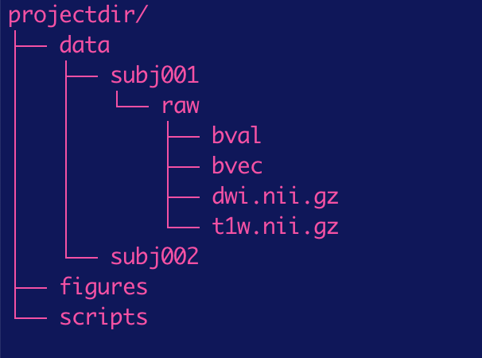

# Processing pipeline for SPAN lab fiber tractography 

Brain regions communicate via long-range axonal connections, referred to as "white matter" because they are covered in fatty (myelin) sheaths that allow for faster communication. Diffusion-weighted imaging allows us to quantify some of the structural properties of these connections. This repository describes a pipeline for getting these structural measurements for tracts of interest, starting from raw diffusion-weighted imaging data. 


## Getting started


### Software requirements 

* [Python 2.7](https://www.python.org/)
* [Matlab](https://www.mathworks.com/products/matlab.html)
* [matlab package, VISTASOFT](https://github.com/vistalab/vistasoft) 
* [spm as a VISTASOFT dependency](https://www.fil.ion.ucl.ac.uk/spm/) 
* [matlab package, AFQ](https://github.com/yeatmanlab/AFQ)
* [mrtrix 3.0](http://www.mrtrix.org/) 
* [freesurfer](https://surfer.nmr.mgh.harvard.edu/) 
* [spantracts (in-house custom scripts for running this pipeline)](https://github.com/spanlab/spantoolbox/tree/master/spantracts)
* [ANTs (coregistration software)](http://stnava.github.io/ANTs/)

### Directory structure 

Pipeline assumes the following directory structure:




### Permissions

make sure the user has permission to execute scripts. From a terminal command line, cd to the scripts directory. Then type:
```
chmod 777 *sh
chmod 777 *py
```
to be able to execute them. This only needs to be run once. 


### Paths

make sure matlab has access to all the relevant paths for running this pipeline. At the matlab command line, type: 
```
path(path, 'path/to/directories/with/matlab/scripts')

```
where 'path/to/directories/with/matlab/scripts' is, e.g., 'projectdir/scripts'. 


## Pipeline (#pipeline)

- [raw data files and format](#raw-data-files-format)
- [Acpc-align t1 data](#acpc-align-t1-data)
- [Run freesurfer recon](#run-freesurfer-recon)
- [Convert freesurfer files to nifti and save out ROI masks](#convert-freesurfer-files-to-nifti-and-save-out-roi-masks)
- [Convert non-anatomical ROIs from standard to native space](#convert-non-anatomical-ROIs-from-standard-to-native-space)
- [Pre-process diffusion data](#pre-process-diffusion-data)
- [Mrtrix pre-processing steps](#mrtrix-pre-processing-steps)
- [fiber tractography](#track-fibers)
- [Clean fiber bundles](#clean-fiber-bundles)
- [Save out measurements from fiber bundles cores](#save-out-measurements-from-fiber-bundles-cores)
- [Correlate diffusivity measures with behavioral and functional measures](#correlate-diffusivity-measures-with-behavioral-and-functional-measures)
- [Create density maps of fiber group endpoints](#create-density-maps-of-fiber-group-endpoints)
- [Quality Assurance checks](#QA)


### Acpc-align t1 data
In matlab, run:
```
mrAnatAverageAcpcNifti
```
Use GUI to manually acpc-align t1 data 

#### output
Save out acpc-aligned nifti to **projectdir/data/anat_proc/t1_acpc.nii.gz**. 


### Run freesurfer recon
From terminal command line, cd to dir with subject's acpc-aligned t1 and run: 
```
recon-all -i t1_acpc.nii.gz -subjid subjid -all
```
This calls freesurfer's recon command to segment brain tissue

#### output
Saves out a bunch of files to directory, **/usr/local/freesurfer/subjects/subjid**.


### Convert freesurfer files to nifti and save out ROI masks
In matlab, run:
```
convertFsSegFiles_script.m
createRoiMasks_script.m
```
To convert freesurfer segmentation files to be in nifti format & save out desired ROI masks based on FS segmentation labels. 

#### output
Saves out files to directory, **projectdir/data/subjid/anat_proc**


### Convert non-anatomical ROIs from standard to native space
From terminal command line, run:
```
t12tlrc_ANTS_script.py
```
and then in matlab, run:
```
xformROIs_script.m
```
To estimate the tranform (using ANTs) between subject's acpc-aligned native space and standard space and to apply the inverse transform to take a given ROI in standard space > subject native space. 

#### output
Saves out acpc-aligned<->standard space transforms to directory, **projectdir/data/subjid/anat_proc**, and saves out a midbrain ROI ("DA.nii.gz") in directory: **projectdir/data/subjid/ROIs**


### Pre-process diffusion data
In Matlab, run:
```
dtiPreProcess_script
```
To do vistasoft standard pre-processing steps on diffusion data. 

#### output
Saves out files to directory, **projdir/data/subjid/dti96trilin**


### mrtrix pre-processing steps 
From terminal command line, run:
```
python mrtrix_proc.py
```
This script: 
* copies b_file and brainmask to mrtrix output dir
* make mrtrix tensor file and fa map (for comparison with mrvista maps and for QA)
* estimate response function using lmax of 8
* estimate fiber orientation distribution (FOD) (for tractography)

#### output
Saves out files to directory, **projectdir/subjid/dti96trilin/mrtrix**. 


### Track fibers
From terminal command line, run:
```
python mrtrix_fibertrack.py
```
tracks fiber pathways between 2 ROIs with desired parameters 

##### output
Saves out files to directory, **projectdir/data/subjid/fibers/dti96trilin/mrtrix**


### Clean fiber bundles
In matlab:
```
cleanFibers_script
```
uses AFQ software to iteratively remove errant fibers 

##### output
Saves out fiber group files to directory, **projectdir/data/subjid/fibers**


### Save out measurements from fiber bundles cores
In matlab:
```
dtiSaveFGMeasures_script & dtiSaveFGMeasures_csv_script
```

### Correlate diffusivity measurements with personality and/or fMRI measures, e.g., impulsivity
Add scripts here for conducting individual difference analyses


### Quality Assurance (QA)
Quality assurance checks should always be performed on data. Some common issues that can go wrong: 

#### bad co-registration
In a viewer, load subject's co-registered anatomy and B0 volumes (files "t1.nii.gz" and "B0.nii.gz"). These should be reasonably aligned. If they aren't, it means that ROI masks (defined based on anatomy) won't be well-aligned to the diffusion data, which could cause problems, especially for small VOIs. 

Here's an example of decent coregistration: 
<p align="center">
  
</p>

And here's an example of bad coregistration (where something went terribly wrong!)
<p align="center">
  
</p>

To correct bad coregistration, follow instuctions outlined in `preprocess_anat_nudge.sh`, then run that instead of preprocess_anat.sh. If coregistration then looks fixed, run `preprocess_cue.sh` as usual. 

#### bad head motion
In matlab, run: 
```
doQA_subj_script.m
```
and then: 
```
doQA_group_script.m
```
to save out figures showing head motion. Figures saved out to **projdir/figures/QA/dwi**. These can be used to determine whether a subject should be excluded due to bad motion. 


